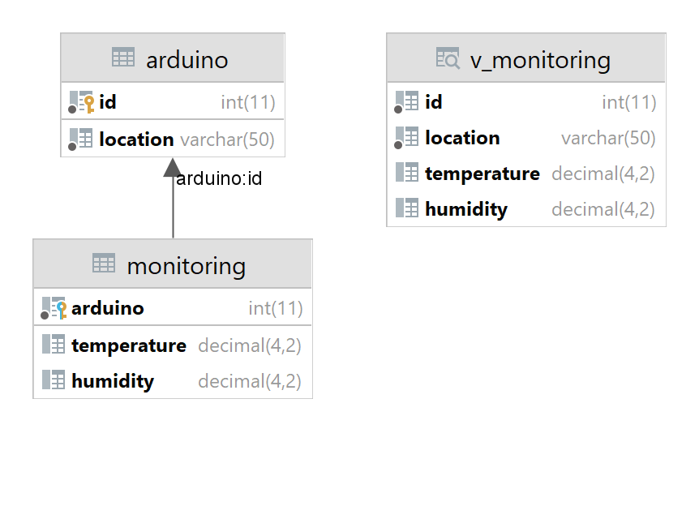

# WeatherPI

This repository serves as a workspace.

WeatherPI is a project that uses an Arduino Uno as the data collector, a RaspberryPi that serves as a base station,
DHT22 sensors for the temperature + humidity, and NRF24L01 wireless modules for wireless communications.

Contributors: [Fresh-glitch](https://github.com/Fresh-glitch)

## Resources

- [Database (SQL)](src/main/resources/database.sql)
- [Python Starter (Shell Script)](src/main/resources/start_python.sh)
- [Database Updater (Python script)](src/main/resources/update_database.py)
- [Datanbase Visualization (Image)](src/main/resources/database.png)
- [Java Class Diagram (Image)](src/main/resources/WeatherPI.png)
- [NRF24L01 + PA + LNA Datasheet (Link)](http://www.haoyuelectronics.com/Attachment/Mini-NRF24L01-SMD/nRF24L01P_Product_Specification_1_0.pdf)
- [DHT22 Datasheet (Link)](https://www.sparkfun.com/datasheets/Sensors/Temperature/DHT22.pdf)

## Preview

## Database

## Java Classes

